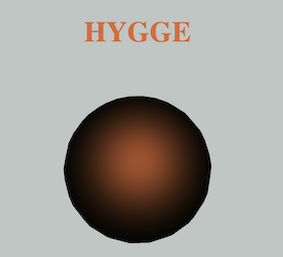

I've made two different programs.
### A:
With the first program I took inspiration in the challenge of making an emoji without trying to imitate any facial expression of human features. I wanted to create something, that visualized the ambience, framing a feeling you’d get, when experiencing something, rather than a visualization of how you would respond or react in that same situation. In my opinion, emojis are very superficial, and so far from what the actual experience would feel like. I think, if you asked every single person, if they thought emojis resembled something of a reaction of feeling, as a real life experience, every single one would say no, of course. But at the same time, we, as a cultural institution with our norms, values and standards, use emojis everywhere. We put so much meaning in these tiny symbols, which is why we begin to get offended by them in the first place, that they can become more meaningful than the words we are saying.
I made a black sphere and a warm orange ambient light that follows the mouse, when pointed at the sphere. I chose the color of orange light to give the atmosphere some warmth to the black facade of the sphere. What the piece should resemble is up to the viewer to interpret. Whatever the viewer finds warm and comfortable. I wrote the name of the piece “HYGGE”, and placed the titled above the sphere. I made this decision to emphasize the point of the work. Maybe I should’ve left it out.
But I guess when it comes to emojis, the symbolism must be spelled out.
### B
The second program was just a simple drawing program. I made the line out of bubbles/circles to do something more interesting than a line. It’s not very creative, but we had to make two emojis, and so this was what I ended up with. It’s not the purpose to draw a face in particular. The program can be used to express yourself with other figures, numbers etc. The point of this piece is that an emoji is subjective, so you might as well just draw it yourself. It probably won’t be a better tool than emojis, but at least you’re the creator.
I really wanted to make some sort of generator, that made it possible to download a picture of your drawn emoji, but I didn’t have the time to make it work. I found “createWriter” which allows you to download text that you can make into an image, but I don’t think this could work with something that you draw live. The three red dots look like the Christiania flag, which was pretty funny to me, and reminded me of Copenhagen and where I grew up.

The first piece is a comment on how we perceive emotions and what we give meaning and power. In the idea of social constructivism our language is what makes our society and dictates how we appear and act in social institutions. With this perspective in mind, we could try to be more aware of how we express ourselves. What I mean is; if we would try to bend how we use our language, we could change the way we think and act. So maybe emojis can’t be universal, because of the symbolic meaning they have in our language/understanding, therefore the solution would be to change the way we use our language, which could be by colors and light. I’m not saying that my piece is a revelation, and the solution is now broadcasted to you. My point is that the power in our actions lies within our language and how we think. This is something impossible so revolutionize, but we could replace the concept of emojis with something like color and light. 

## Links
### A: HYGGE
### [Code:](https://gitlab.com/OskarBuhl/aesthetic-programming/-/blob/main/miniX2_1/sketch.js)

### [Runme:](https://oskarbuhl.gitlab.io/aesthetic-programming/miniX2_1/)

### B: EXPRESS YOURSELF
### [Code:](https://gitlab.com/OskarBuhl/aesthetic-programming/-/blob/main/minix2_2/sketch_2.js)
###: [Runme:](https://oskarbuhl.gitlab.io/aesthetic-programming/minix2_2/)
