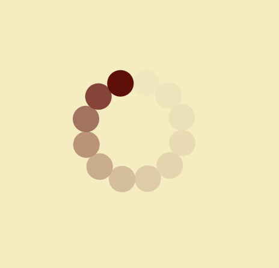

Code:https://gitlab.com/OskarBuhl/aesthetic-programming/-/blob/main/miniX3/sketch.js
RunMe: https://oskarbuhl.gitlab.io/aesthetic-programming/miniX3/

With this MiniX I wanted to have a different approach by writing the readme first while coming up with the concept of this miniX. My initial thought was to create a background made of different loading screens from the most famous and used computer systems (Apple, Windows), and then making the famous throbber, that would count the percent of development until 99% and then just freeze there. Simultaneously the throbber from the Mac computers appears and just keep scrolling. Maybe some text would appear, something like: "you're not wasting your life/time, wait just a minute more". This would be comment on, how we use so much of our time by waiting for some digital clue of response, that would tell us what to do next, like we can't think for ourselves.

What I then wanted to do was to create some sort of simulation. I was thinking about time, and how we live our lives according to stages or levels. First, we want to finish some stages or levels in life in terms of education. Then a good job etc. Then getting married, having kids, a nice house: "The Game of Life". I like the metaphor, "The Game of Life” because it makes sense to me. We live to fulfill these levels, and like in many games, life is very competitive to many people. If you were so be stalled because of an error, something that goes wrong in your life, it feels like a setback, and everyone you know are moving forward, while you're stuck in the previous level, trying to move on to the next. This is where the throbber comes in play. My project is meant to be interpreted as a throbber of life, as a symbol of how you have no choice, but to wait it out, if an error occurs in a game, as in life.

You could argue that life itself and how people structure their lives is a loop. Although a loop is a controlled and automated structure within a machine, people create loops in their lives to create structure and satisfaction. Many of our actions are automated in some sense, and they keep repeating themselves. For example, how we transport ourselves through our day is somewhat in a loop. We have certain structures for how we go to work, drive the same route to the supermarket, drive the same route home to cook, eat, and sleep. Some people even eat the same dishes every week because it is easier for them. These structures are, like in programming, made to make your life, or program, more efficient. What that means is we try to manipulate our perception of time (Goodyear, 2004). In relation to life itself as a loop some religions believe in reincarnation, which changes the way you might interpret time. “Humans live with the implicit awareness that their death is already future in the past, a dynamically deferred futurum exactum.“ (Ernst, 2009). Ernst mentions Heidegger’s interpretation of our awareness of the end of our lives. This awareness of our death in the future is what defines our perception of time. We modify it by making time feel like it moves faster by having fun or escaping into a parallel universe like in games, or slower. Imagine if you could adjust the framerate of your life, so that you could actively perceive life in different speed of time. Machines are easier to manipulate in this way, but as mentioned, humans can manipulate their perception of time as well.

My perception of a throbber is that its objective is to stall me, so that I don't get impatient. To me it can become very provocative. The throbber itself is a very simple object, but the idea or purpose behind the simple object is very clever. The throbber can outsmart me and us, making us wait for something that we do not necessarily know what is. At the back end, something is loading or maybe crashed, but we don't know. We assume that the throbber is feedback when it is just an item to discipline us in some way. 

Refrence:
Goodyear, Jonathan D., "Life is a loop." CODE Magazine (2004)
Ernst, Wolfgang. "... Else Loop Forever”: The Untimeliness of Media’." Extended draft paper for ‘Il Senso della Fine’, conference. Universita degli Studi di Urbino. 2009.

