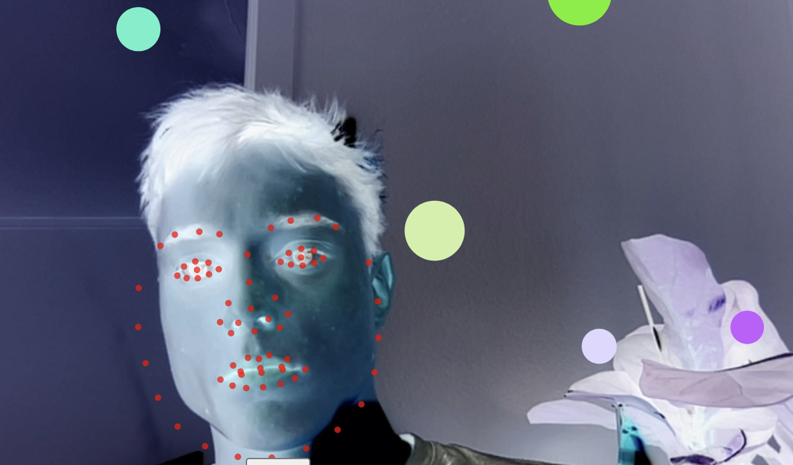

# Game of Capta

#### Run me: https://oskarbuhl.gitlab.io/aesthetic-programming/miniX4/ - I think you have to use chrome, but I'm not sure. The camera didn't work the first time i tried.
#### Code: https://gitlab.com/-/ide/project/OskarBuhl/aesthetic-programming/tree/main/-/miniX4/sketch.js/

## Project description
My project is called “Game of Capta”. It is a game in which you are supposed to avoid the falling circles to hit the circle centered at the nose of the user’s face. The volume of your voice can make the circle, positioned at your nose, move forward as the volume increases. With the space key you can pause the game, so that the falling balls pause in midair. By pressing your mouse, a new circle will appear at the spot you pressed the mouse. The game has no explanation, and it is not clear whether you are supposed to hit the falling balls with the circle on your nose, or if you are to avoid them. The goal is therefore unclear to the user. The object of the “game” is to illustrate how many inputs a computer can capture data from. The camera captures the movement of your face. The keyboard listens if you use the space key. The microphone listens to the volume of sound. And the mouse captures your x and y coordinates and response to when you click the mouse. All these data capture components create this simple game.

## Code description
My program is a remix of two programs. It is not very good, it is actually pretty bad, and it doesn’t work, but I was short on time last this week, and I worked more on the concept, than the actual program. I used the clm.trackr, from class, which tracks the face with 71 points. The program also uses the microphone, listens to the keyboard and the mouse. I added another program by the user “zomert1”, which is a bunch of balls/circles falling down the canvas. If you press the mouse another circle will appear. I combined the two and change the values in the loop to make the balls/circles falling smaller and appear in a smaller quantity, and the same with the appearing balls/circles. I learned a lot during this miniX. The cml.trackr was very cool, and it would definitely be fun to use it again some time. The button was new as well, also how you can style it in css was very cool. Also, at the end of the source code, there is an object used. It is used to draw the circles, and I think it is to make the program remember where a previous ball has appeared. Also, the canvas is set to 640,480, because the clmtrackr is set to those coordinates.

## Articulate how your program and thinking address the theme of “capture all.” What are the cultural implications of data capture?

After reading the article "Datafication", by Ulises A. Mejias and Nick Couldry, I was inspired to make a program that really showed the viewer/user how many sources a computer can get data input from its user. Although Mejias and Couldry argues that it is not data it is capta: "Kitchin even argues that “data” should be replaced with another Latin term, capta—what is captured—to refer to how, practically, data is harvested from life.". By using another term for what companies, governments etc. extract with datafication, we will begin to understand the abuse. Right now, the discourse of datafication surrounds how algorithms are the ones who steal our data, and we cannot even begin to understand how it works, or who is responsible for the action. There is a carpet of mystery wrapped around datafication, and by addressing the subject with this discourse, the media and ordinary people almost choose to not care about the issue. As Mejias and Couldry mention “Shoshana Zuboff argues that what we are living through is a new stage of “surveillance capitalism”. You could argue, that at the state we are at now with datafication by companies as Meta, Google etc. are responsible for this revolution in the tech industry.
