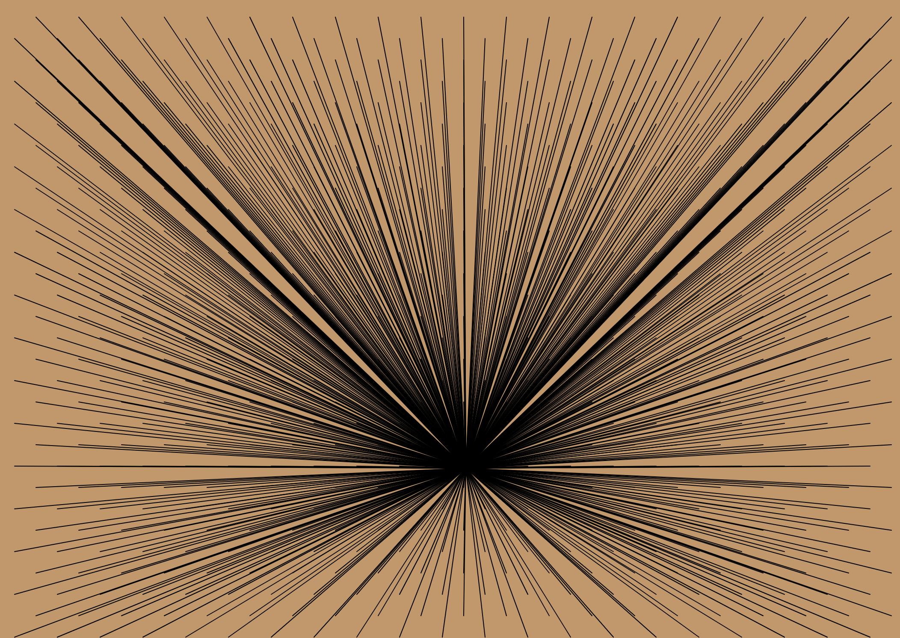

It was very difficult, for me, to create these simple rules. I always want to do something original, that would make people go “wow I didn’t think of that”, but I guess that is to set the bar a little too high for every miniX at least. What I came up with was the following rules:

The rules for this auto generative program are:
* **Draw a grid of lines.**
* **Make every line connect to a center.**
* **Move the center diagonally back and forth.**

I have set the program to go back and forth, because otherwise the center would just go beyond the canvas, and I believe the viewer would lose interest. There is not a random or noise element in my program, so in that sense I am not even sure if it is an auto generative program. It does not change over time and is therefore somewhat static. I could have put in a noise element perhaps, to make the center move “randomly” across the canvas, but then the expression of the program would be something else. But as Galanter states: **“The problem with such attempts at definition is that they mistake options and choices within the field of generative art as being requirements for generative art. The other option is to create a big tent that accommodates all kinds of generative art and discussion.”** (Galanter, 2016). Generative art is, by his definition: **“any art practice in which the artist uses a system, such as a set of natural language rules, a computer program, a machine, or other procedural invention, that is set into motion with some degree of autonomy, thereby contributing to or resulting in a completed work of art.”** (Galanter, 2016). So, I suppose my program is generative art after all.

In relation to how my program produces emergent behavior, I would say that the lines create this pattern because they are linked to a center point. Without the center point they could point wherever. And without the movement diagonally the effect of the lines connected would perhaps not appear if the center did not move. So, in conclusion, the rules together create the program, and they therefore produce emergent behavior.

The rules play an essential role in the program, since they create the work emerged from the pattern and behavior that are written in the rules. The rules or the system behind the program are very naked to the eye. It is not a pattern that is hard to examine and figure out. It would be interesting to create an auto generative work that would chase the idea of making the machine as free as possible. Not bound in chains by rules, but somewhat free from constraints. A computer is trapped or imprisoned in some sense, and I believe it would be very difficult to attempt to set it free. Perhaps this is only possible by AI and machine learning since the machine can learn itself new paths and patterns.

After Galanter mentions his definition of generative art from 2003, he elaborates: **“The key element in generative art is the use of an external system to which the artist cedes partial or total control.“** (Galanter, 2016). This quote states very well how my understanding of my partnership with my computer. At first, I thought the that in auto generative art the computer had control of the outcome, but I see now, how trapped the computer is in fact. My systems are forced down the throat of the computer, and the partnership is a crumpling structure of my imagination. I suppose that my knowledge on this theme is not very sufficient, but I believe I have learnt something unique of the way I think of my computer.

### Links
#### [Code](https://gitlab.com/OskarBuhl/aesthetic-programming/-/blob/main/miniX5/sketch.js)

#### [RunMe](https://oskarbuhl.gitlab.io/aesthetic-programming/miniX5/)

### Reference:
* Galanter, Philip. "Generative art theory." A Companion to Digital Art 1 (2016): 631.
