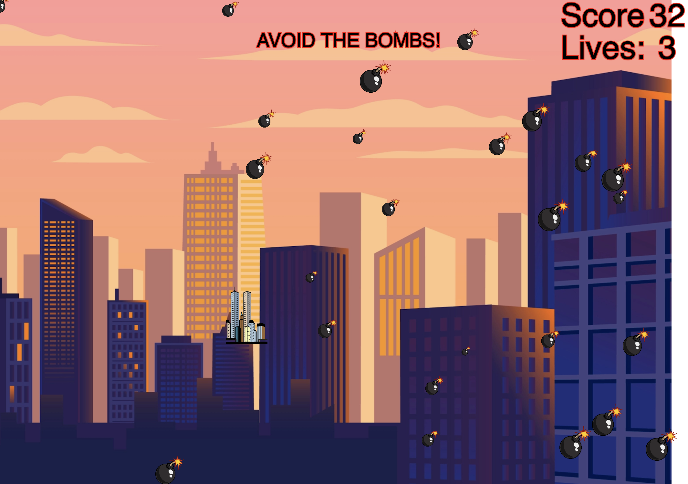
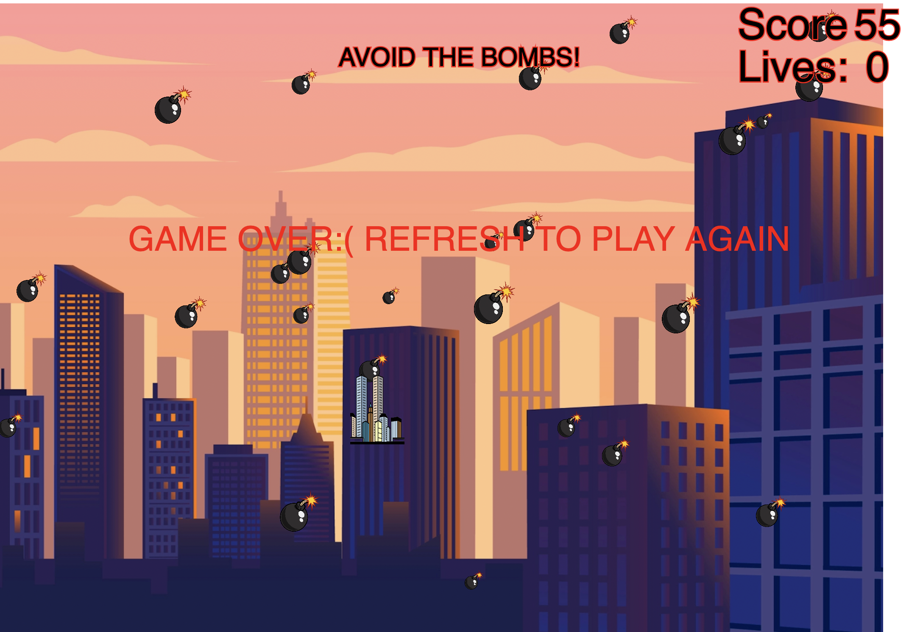

 

The game is called Sky Bomber, and it is quite the opposite of the Pacman game where you need to eat something, in this game the object is to avoid 25 falling objects/bombs from the sky. I used an imagine of a bomb to make a class, so that I could control the behavior, size etc. of each object. I then used another image of some buildings which the player controls with her/his mouse position. The program keeps score of how many bomb objects that have been spliced form the array, this is indicated as the count of the score. I gave the player three lives, because I wanted to make it challenging to stay alive for too long. When the function “lose” counts the health to 0 the loop will stop, and the screen freezes with the text: “GAME OVER:( REFRESH TO PLAY AGAIN”. It is a silly game, but the idea was rooted in the Ukrainian war that is raging at the moment. This is not meant as a joke. I watched Volodymyr Zelenskyj’s speech where he mentioned how many bombs Russia used every day, and how many they had used so far. Although my inspiration came from this speech and the war, I did not want to emphasize this, because it is a serious matter, and it would be inappropriate.  

As mentioned, I have used images for my game. To make the game less predictable, I used random to set a random speed, size, and starting point for the vector for each object. This would make them appear different places on the screen as well have different sizes and speed. I then used an image as the “character”. I set the x,y coordinates of the character to the mouseX and mouseY to make it interact with the mouse. The logic of the game is to avoid the bombs and get a high score. To do this, I needed function (checkBombFall), which could track the position of each object, and if the object was beyond the height, the function would splice it (remove it) from the array of bombs and count the score once. Also, I needed a function with the dist function to calculate when the bomb hits the character, which would mean loss of a life, and when the bomb is outside of the character size. I used the coordinates of the mouse position for the first coordinate set, and the bomb position for the second coordinate set in the dist function. Now I can make a conditional statement with a Boolean: if the bomb is within the size of the building lose a life, if not then count it as a point. And of course, splice the bomb from the array either way. As mentioned, the game end with a noLoop that freezes the frame.

As the name gives away object-oriented programming is a method of creating objects which the computer sees as objects as well, instead of a piece of code that the program executes in the order it is programmed to. The implications of abstraction are both in ways of how we can reduce the complexity of the code by create object with methods and properties, and how the objects relate to the real world and the “interactions between and with the computational.” (Soon et al., 2020)
So as the bomb object seems to hit the character, we would understand that it explodes and therefore disappears. At the same time, the program understands this action as within the character it deletes the object, and the result of the action is really with the “health” or “lives” and not the character as it seems. The abstraction of the bomb object is only an image that moves with a speed, and it can only be deleted, whether it hits the building character of goes out of the screen, it will be deleted, and it is not destructive as we now bombs to be. The building has a behavior as well, that is very different from the behavior of a real building. The abstraction of the building is in the interaction with the player and the mouse/computer input. (Soon et al., 2020)

#### Code:    
#### RunMe:  https://oskarbuhl.gitlab.io/aesthetic-programming/miniX6/

### Refrence:
* Soon Winnie & Cox, Geoff, "Object abstraction", Aesthetic Programming: A Handbook of Software Studies, London: Open Humanities Press, 2020, pp. 143-164
* [4 pillars of OOP](https://www.youtube.com/watch?v=pTB0EiLXUC8)
