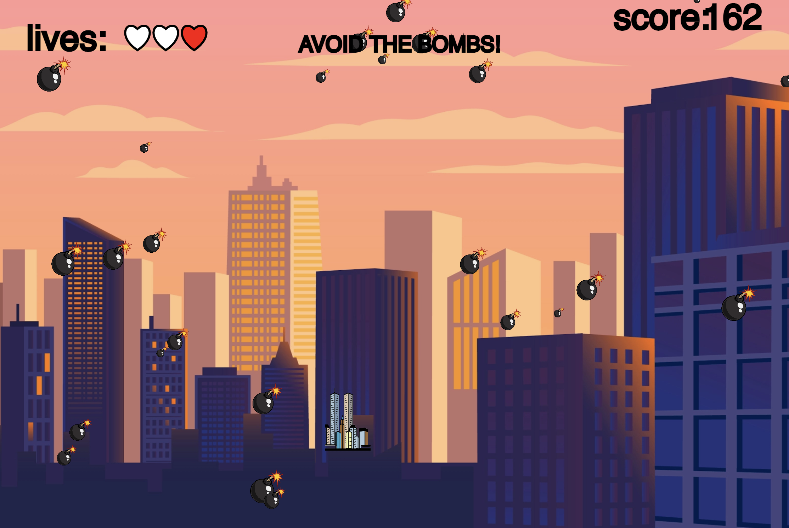
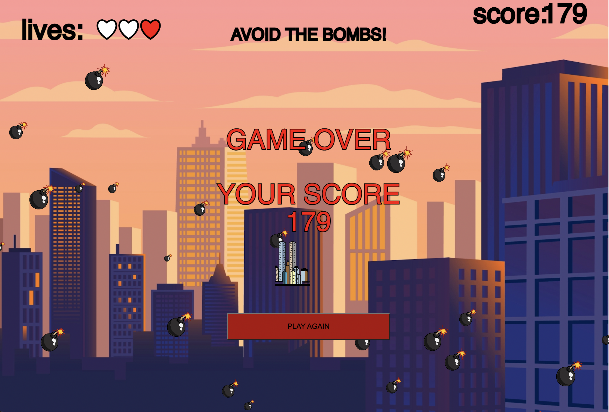

## Sky Bomber

I have chosen to advance my miniX6, because I realized that there was a lot of potential in a game. The limits of features that you can add to a game is endless almost. I wanted to make the game more aesthetic and to work more with the abstraction of object-oriented programming by adding sound for example. For my miniX6 I created a game called Sky Bomber. The inspiration for the program came from the speech by Zelenskyj where he mentioned how many bombs Russia has used in the war. The game is not a joke on the war, and I have not implemented any realistic objects or anything. It was mere the idea.

First, I wanted to make it more appealing by fixing the background. I made the size of the image larger, and it looks better now, but if the screen is too big, it still has some flaws. I removed the “Lives” and added hearts instead which turns white, when the player loses a life. I wanted to embrace abstraction of object-oriented programming, by this I mean increase the level of real-world entities. I could have made the hearts into objects, but I just thought of that while writing this.
Then I added a “Play again” button, which appears when “health=0” and the game freezes by noLoop. I created the function “reloadCanvas” and used the “window.location.reload()” which I set to “true”. Furthermore, I added the display of the players score, again when the players have lost all lives, the score appears in the middle of the screen. Finally, I added a sound for when the bomb hits the building character, which were to raise the level of abstraction by create a richer connection to the real-world. All the adjustments were made to create a more aesthetic game in terms of functionality and appearance. The adjustments, maybe except for the reload button, does not make the game more efficient, but they are meant to create a richer experience while playing the game, an attempt of creating a deeper involvement.

The concept of the game from the previous version is somewhat the same, but the focus of objective has shifted. Before the focus was of a functional game. Now the focus has shifted to bring more depth, abstraction, and aesthetics into the game, in hope to create a greater experience for the player. As I interpret the goal of object-oriented programming, it is to bring the player into a world, where the level of abstraction is great. This means that, when playing the game, the player experience details and entities that resembles the real world, but without details of how it works. The game experience must be only what is presented to the player. This offer of experience and interactions to the player, makes the player able to become somewhat of an extension of the program.

“Digital culture refers to culture shaped by the emergence and use of digital technologies.” (Miller, 2012). Since the digitalization of, lets focus on the western world, of the western world our culture has been shaped and influenced by for example the internet and personal computers. The revolutionizing world of tech has grown faster than we could foresee the impact of it. I personally believe digitalization is amazing, powerful, and essential, but what happens, when digitalization shapes culture in ways we do not understand? This is the relation between aesthetic programming and digital culture. Aesthetic programming is a method of critical thinking, like software studies, focused on what is programmable (Chun, 2008). I believe that nothing affects our culture in 2022 more than what is programmable. What I mean is software. Aesthetic programming is, as mentioned, a method of critical thinking about software and what that piece of software intervenes with in our culture. For example, you could use emojis as an example. Emojis seems very harmless as a software, but they have excluded many people from the part of culture that is emojis. This means every time the excluded person communicates on her/his phone, they will probably be reminded of this, and since nothing on the internet is local, the magnitude and result of this is huge for the excluded person. It means that on a global basis, this person is being excluded for being an “outsider”. (Abbing et al., 2017). This critical perspective is essential for our modern world, and that is what aesthetic programming, as a critical method, can be used for.

With object-oriented programming, I demonstrate an aesthetic programming perspective. It is not a program that allows the viewer to join my thought per se, but my approach for this miniX7 has very much been critical. I have explored abstraction in relation to object-oriented programming, and I have learned a lot from acquiring or trying to understand this perspective.

[RunMe](https://oskarbuhl.gitlab.io/aesthetic-programming/miniX7/)
[Code](https://gitlab.com/OskarBuhl/aesthetic-programming/-/blob/main/miniX7/sketch.js)

### Refrence:

* Soon Winnie & Cox, Geoff, "Object abstraction", Aesthetic Programming: A Handbook of Software Studies, London: Open Humanities Press, 2020, pp. 143-164
* Miller, Vincent. "Understanding Digital Culture1." (2012).

* Chun, Wendy Hui Kyong. "Programmability." Software studies: A lexicon (2008): 224-229.

* Abbing, Roel Roscam, Peggy Pierrot, and Femke Snelting. "Modifying the universal." Executing Practices 33 (2017).
